# Shopping List Collaboration App

**Shopping List Collaboration App** enables users to create groups, manage shopping lists, and collaborate in real-time with other group members. Built as an **offline-first application**, it ensures that changes happen locally and are synced with the remote database on intervels. Real-time collaboration is specifically implemented for shopping list items, providing an efficient and seamless experience.

## Features

### User Authentication
- Secure user authentication via Supabase.
- Users can register and log in using email and password.

### Groups
- Users can create groups and invite other members.
- Members can join a group using an invite code.
- Groups facilitate collaborative shopping list management.

### Shopping Lists
- Users can create shopping lists within groups.
- Shopping lists include:
  - Item name
  - Quantity
  - Unit (e.g., kg, pcs)
  - Category
  - Priority level
  - Notes
  - Purchased status

### Collaboration
- Real-time updates for shopping list items when members add, edit, or delete items.
- Supabase Realtime broadcasting is used.

### Notifications
- Toast notifications for successful actions and errors.

### Offline Support
- Local database storage for offline access.
- Sync functionality ensures local changes are reconciled with remote data.

## Technical Overview

### Tech Stack
- **Frontend**: React Native with Expo
- **Routing**: Expo Router
- **UI**: Tamagui (UI components and styles), Zeego (Native styles menus), Formik (form handling)
- **Animation**: react-native-gesture-handler, react-native-reanimated
- **Backend**: Supabase (authentication, database, real-time subscriptions)
- **Database**: PostgreSQL (Supabase)

### Key Functionalities

#### Offline-First Architecture
- The app prioritizes offline functionality by storing data locally.
- Users can make changes to shopping list items even without an internet connection.
- Synchronization ensures that local changes are updated on the remote database when the app regains connectivity.

#### Real-Time Collaboration
The app uses Supabase Realtime subscriptions exclusively for shopping list items:
- Broadcasts are sent when a user makes changes to a shopping list.
- All users in the group receive updates and see changes immediately.

#### Group Membership
- Groups are the core unit of collaboration.
- Each group maintains its own set of shopping lists.
- Membership is managed through the `group_members` table.

### Database Schema

#### Tables
1. **Users**: Contains user information.
2. **Groups**: Stores group details.
3. **Group Members**: Links users to groups.
4. **Shopping Lists**: Stores shopping list details.
5. **Shopping List Items**: Stores individual items in a shopping list.

# Screenshots

  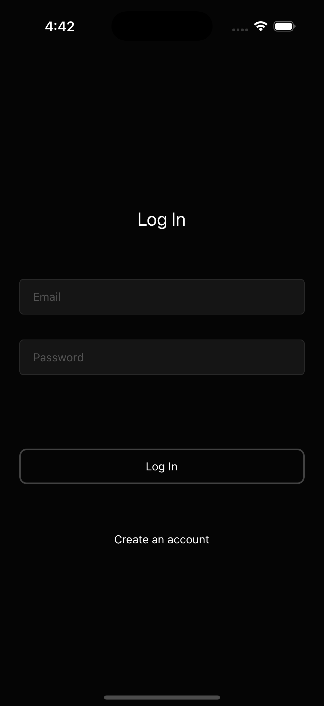
  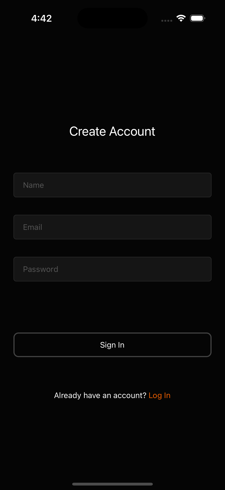
  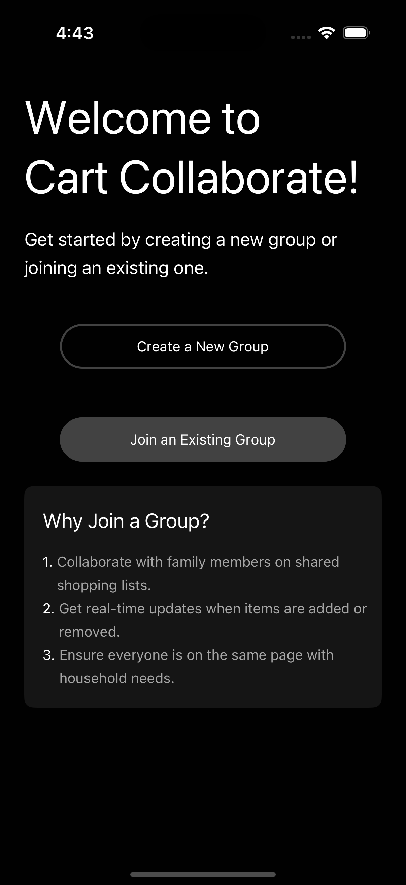
  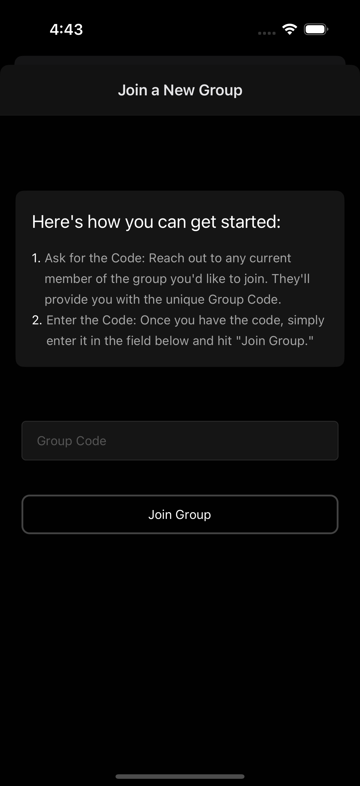
  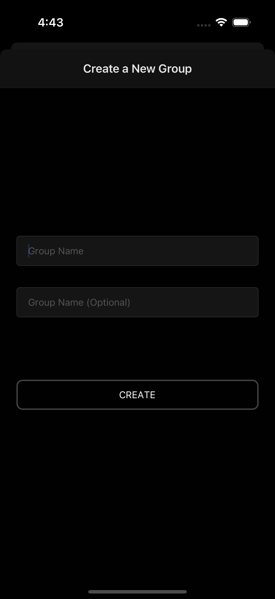
  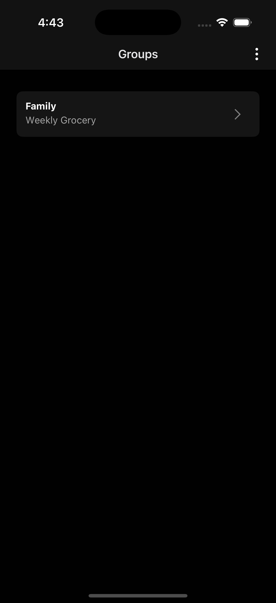
  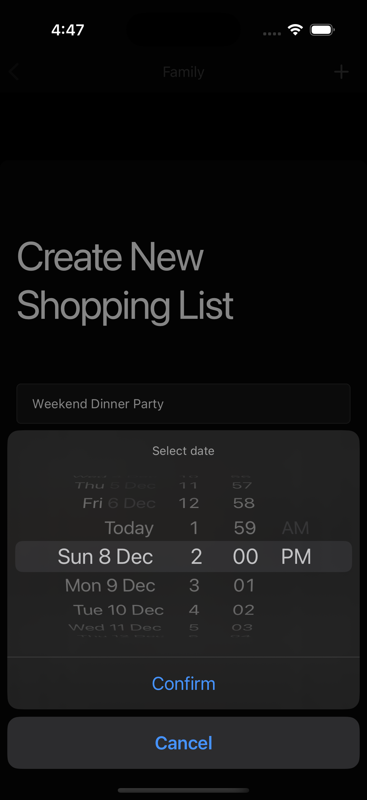
  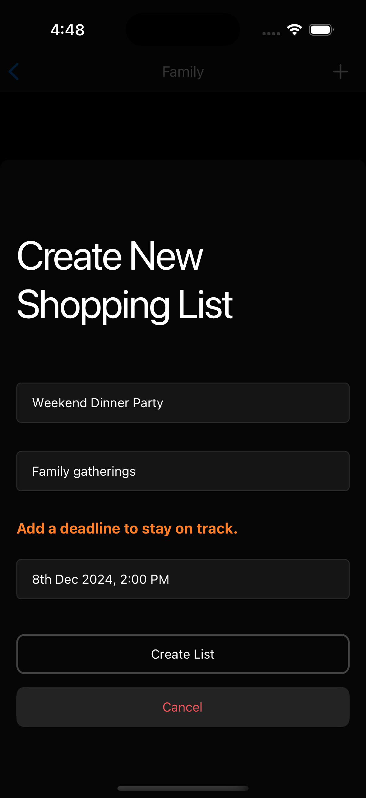
  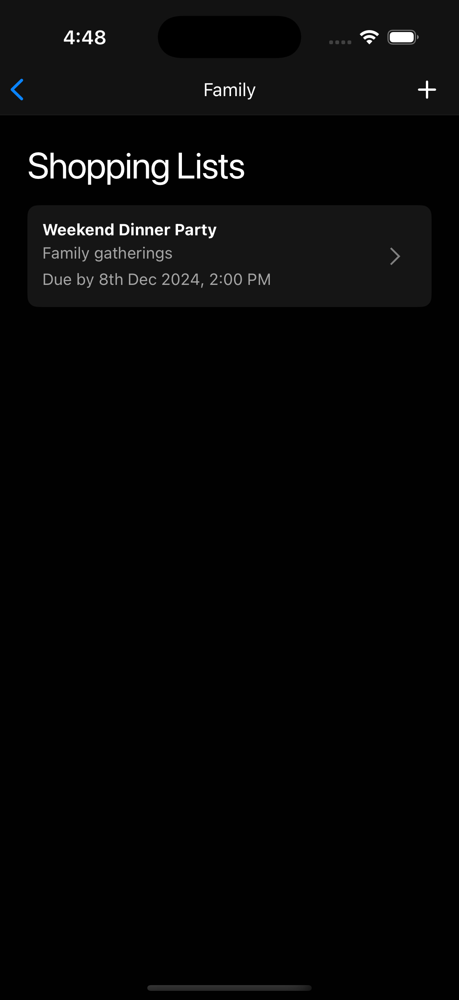
  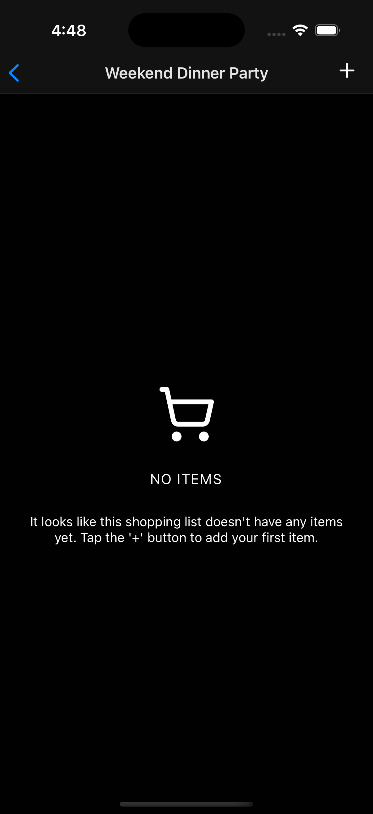
  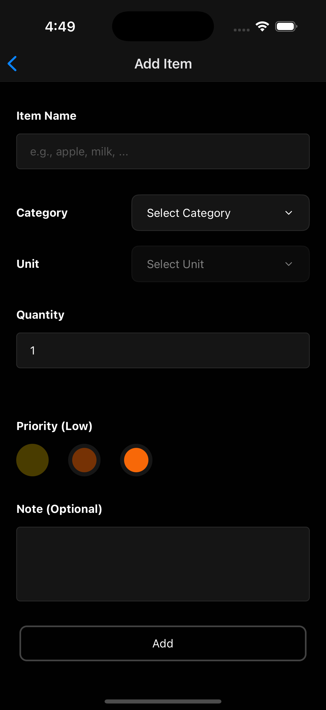
  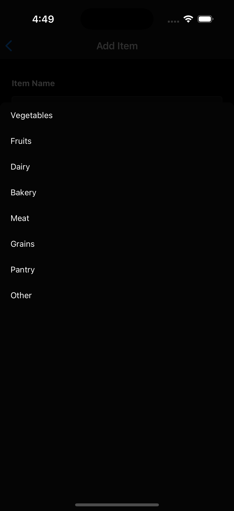
  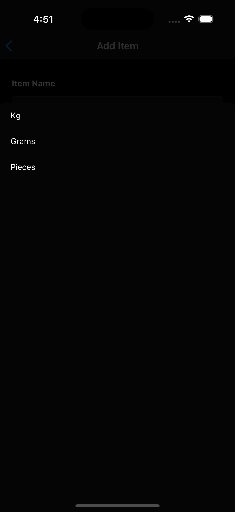
  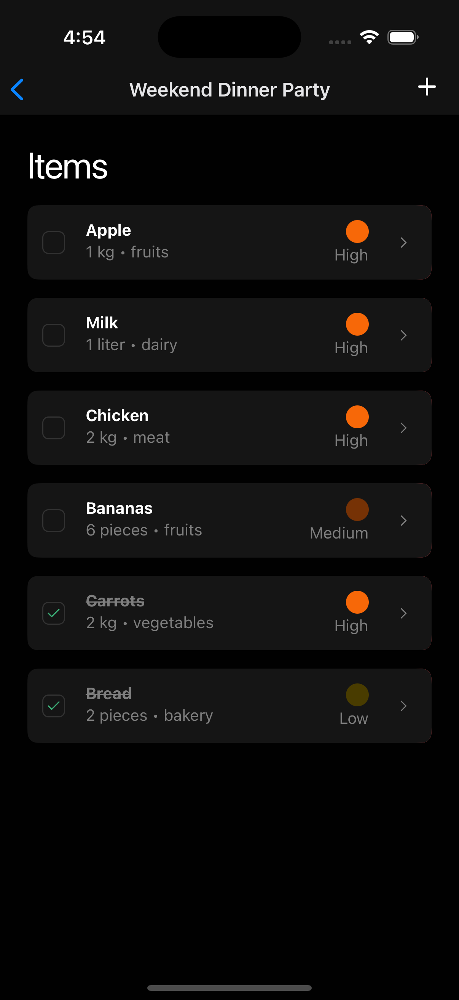
  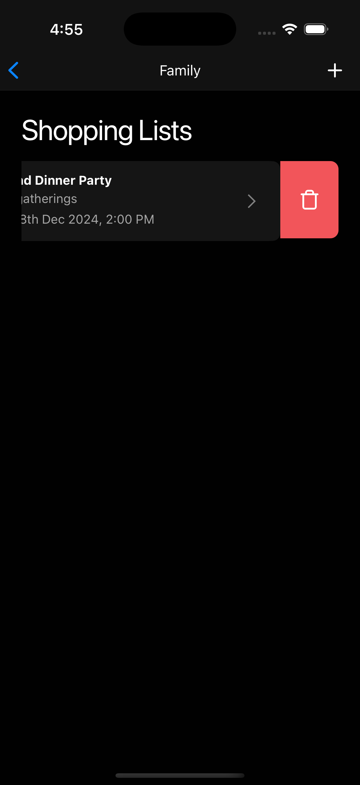
  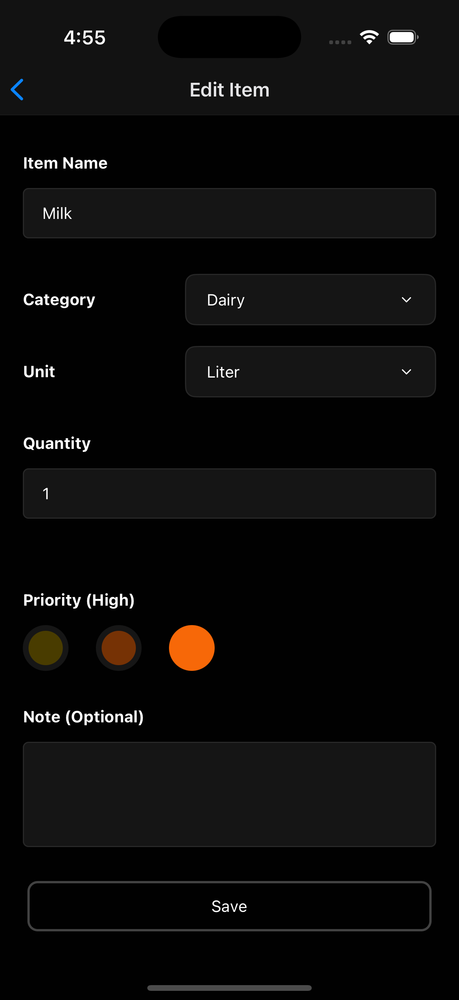
  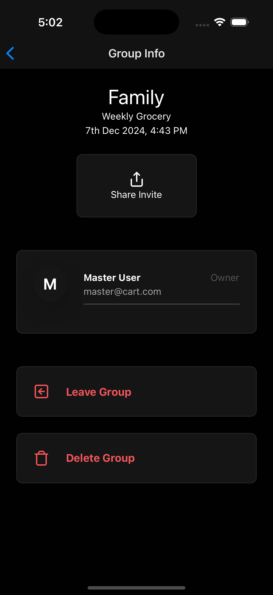
  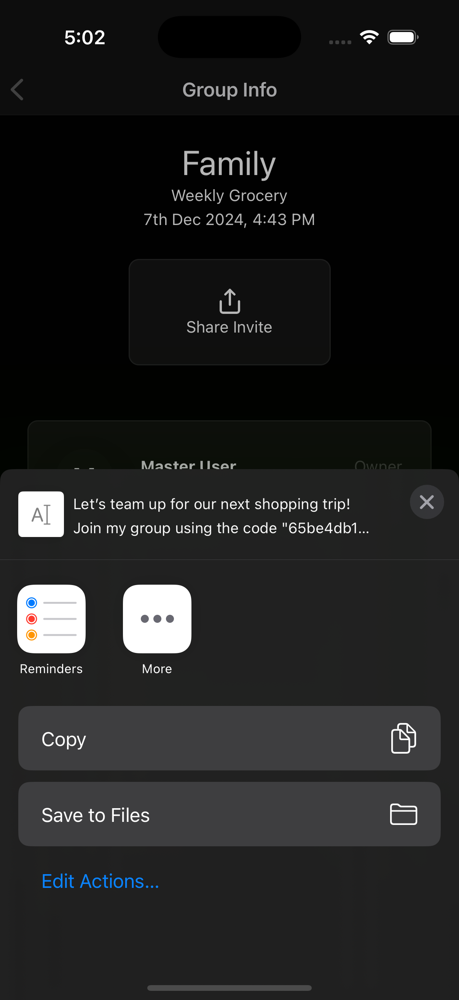

## References

- [Watermelondb Docs](https://watermelondb.dev/docs/Sync/Intro)
- [Syncing the local DB with Supabase](https://supabase.com/blog/react-native-offline-first-watermelon-db)
